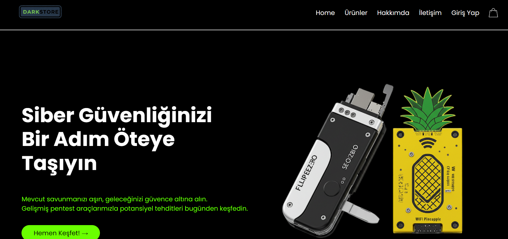
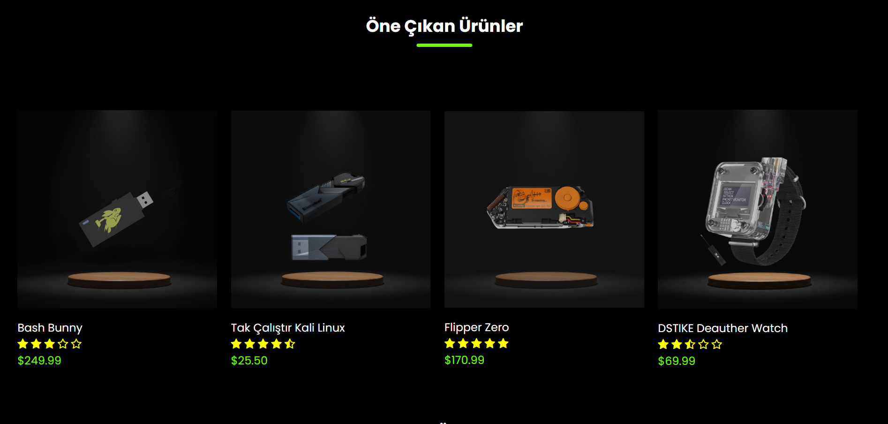

# 🛡️ Siber Güvenlik ve Donanım Ürünleri Tanıtım Sitesi

Bu proje, siber güvenlik dünyasına ilgi duyanlar ve profesyoneller için özel olarak tasarlanmış, **tek sayfalık, statik bir web sitesidir**. Amacımız, **Flipper Zero** gibi popüler ve yenilikçi siber güvenlik donanım ve yazılım ürünlerini sade, modern ve görsel bir arayüzle tanıtmaktır. Herhangi bir etkileşim veya e-ticaret özelliği içermese de, ürünlerin temel özelliklerini ve fiyat bilgilerini net bir şekilde sunarak ziyaretçilerin hızlıca bilgi edinmesini sağlar.

---

## 📸 Ekran Görüntüleri

Sitenin ana görünümü ve öne çıkan bazı ürünlerin sergilenmesi:

### Ana Sayfa Genel Bakış

*Modern ve temiz tasarımıyla siber güvenlik ürünlerinin genel görünümü.*

### Ürün Detayı Örneği

*Popüler Flipper Zero gibi ürünlerin detaylı görsel sunumu ve fiyat bilgisi.*

---

## 🛠️ Kullanılan Teknolojiler

Bu statik web sitesi projesi, temel web geliştirme teknolojileri kullanılarak oluşturulmuştur:

* **HTML5:** Sitenin sağlam iskeletini ve ürün bilgilerinin yapısal düzenini sağlamak için.
* **CSS3:** Çekici görsel tasarımı, duyarlı düzeni ve kullanıcı dostu arayüzü oluşturmak için.

---

## ✨ Temel Özellikler

* **Tek Sayfalık Yapı:** Tüm önemli bilgileri tek bir kolay erişilebilir sayfada toplar.
* **Ürün Odaklı Sunum:** Flipper Zero gibi popüler siber güvenlik donanım ve yazılımlarını vurgular.
* **Görsel Ağırlıklı Tasarım:** Ürünlerin yüksek kaliteli görsellerle desteklenerek öne çıkarılması.
* **Fiyat Bilgilendirmesi:** Her ürün için güncel fiyat bilgilerini içerir.
* **Basit ve Sezgisel Arayüz:** Ziyaretçilerin rahatça gezinebileceği kullanıcı dostu bir tasarım.
* **Statik İçerik:** Herhangi bir dinamik özellik (sepete ekleme, form gönderimi vb.) içermez, bilgi amaçlıdır.

---

## ⚙️ Yerelde Çalıştırma

Bu projeyi kendi bilgisayarınızda görüntülemek için aşağıdaki adımları takip edebilirsiniz:

1.  Bu GitHub deposunu bilgisayarınıza klonlayın veya zip olarak indirin.
    ```bash
    git clone https://github.com/ImNot-Virus/CyberSecurityProducts-SiberGuvenlikUrunleri.git

    ```
2.  Projenin ana klasörüne gidin:
    ```bash
    cd CyberSecurityProducts-SiberGuvenlikUrunleri

    ```
3.  `index.html` dosyasını tercih ettiğiniz herhangi bir web tarayıcısında (Google Chrome, Mozilla Firefox, Microsoft Edge vb.) açın.

---


EL DIABLO

---
